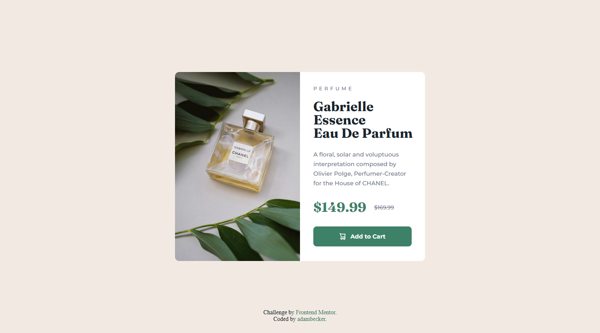

# Product Preview Card Component

## Table of Contents

- [Overview](#overview)
  - [The challenge](#the-challenge)
  - [Screenshot](#screenshot)
  - [Links](#links)
- [My Process](#my-process)
  - [Built With](#built-with)
  - [What I Learned](#what-i-learned)
  - [Continued Development](#continued-development)
- [Author](#author)

---

## Overview

### The Challenge
The task was to create a responsive product preview card that:
- Closely matches the design provided in the challenge.
- Functions seamlessly across different screen sizes (mobile-first design).
- Adheres to semantic HTML structure and accessibility best practices.

### Screenshot

### Links
- **Live Site URL**: [View Live Site](https://fem-product-preview-card-component-iota.vercel.app/)
- **Solution URL**: [View Solution on Frontend Mentor](https://www.frontendmentor.io/solutions/responsive-product-preview-card-qcorPeabc1)

---

## My Process

### Built With
- **HTML5**: Semantic structure for improved readability and accessibility.
- **CSS**:
  - Flexbox for responsive and flexible layouts.
  - Media queries to ensure mobile-first responsiveness.
  - Custom properties for maintainable and reusable styling.
- **Mobile-first Approach**: Designed for small screens first and progressively enhanced for larger devices.

### What I Learned
This project taught me:
1. **Mobile-First Design**: Prioritizing small screens first made the layout cleaner and easier to scale up.
2. **CSS Variables**: Using variables for colors, typography, and spacing simplified adjustments and ensured consistency.
3. **Accessibility**: Adding ARIA labels, focus-visible styles, and semantic HTML improved usability for all users.

### Continued Development
Moving forward, I want to focus on:
- **Desktop Design Enhancements**: Further refining the layout for larger screens.
- **Accessibility Testing**: Using screen readers and accessibility tools to identify and fix potential issues.
- **Interactivity**: Adding subtle animations or hover effects to enhance the user experience.

---

## Author
- **Frontend Mentor**: [Profile](https://www.frontendmentor.io/profile/adambeckercodes)
- **GitHub**: [Profile](https://github.com/adambeckercodes)
- **Twitter**: [Profile](https://x.com/adambeckercodes)
